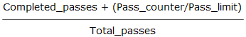

Some applications may need to regain control from the JPEG library every so often. The typical use of this feature is to produce a percent-done bar or other progress display. Although you do get control back frequently during the data-transferring pass (the <xref:BitMiracle.LibJpeg.Classic.jpeg_decompress_struct.jpeg_read_scanlines(System.Byte[][],System.Int32)> or <xref:BitMiracle.LibJpeg.Classic.jpeg_compress_struct.jpeg_write_scanlines(System.Byte[][],System.Int32)> loop), any additional passes will occur inside <xref:BitMiracle.LibJpeg.Classic.jpeg_compress_struct.jpeg_finish_compress> or <xref:BitMiracle.LibJpeg.Classic.jpeg_decompress_struct.jpeg_start_decompress>; those routines may take a long time to execute, and you don't get control back until they are done. 

You can define a progress-monitor routine which will be called periodically by the library. No guarantees are made about how often this call will occur, so we don't recommend you use it for mouse tracking or anything like that. At present, a call will occur once per MCU row, scanline, or sample row group, whichever unit is convenient for the current processing mode; so the wider the image, the longer the time between calls. During the data transferring pass, only one call occurs per call of <xref:BitMiracle.LibJpeg.Classic.jpeg_decompress_struct.jpeg_read_scanlines(System.Byte[][],System.Int32)> or <xref:BitMiracle.LibJpeg.Classic.jpeg_compress_struct.jpeg_write_scanlines(System.Byte[][],System.Int32)>, so don't pass a large number of scanlines at once if you want fine resolution in the progress count. (If you really need to use the callback mechanism for time-critical tasks like mouse tracking, you could insert additional calls inside some of the library's inner loops.) 

To establish a progress-monitor callback, create an object of <xref:BitMiracle.LibJpeg.Classic.jpeg_progress_mgr>, subscribe to its <xref:BitMiracle.LibJpeg.Classic.jpeg_progress_mgr.OnProgress> event and set cinfo.Progress to this object. The callback will be called whenever cinfo.Progress is non-null. (This property is set to null initially; the library will not change it thereafter) You can use the same callback routine for both compression and decompression. 

The <xref:BitMiracle.LibJpeg.Classic.jpeg_progress_mgr> class contains four properties which are set by the library:

|Property|Description|
|---|---|
|<xref:BitMiracle.LibJpeg.Classic.jpeg_progress_mgr.Pass_counter>|Work units completed in this pass|
|<xref:BitMiracle.LibJpeg.Classic.jpeg_progress_mgr.Pass_limit>|Total number of work units in this pass|
|<xref:BitMiracle.LibJpeg.Classic.jpeg_progress_mgr.Completed_passes>|Passes completed so far|
|<xref:BitMiracle.LibJpeg.Classic.jpeg_progress_mgr.Total_passes>|Total number of passes expected|

During any one pass, <xref:BitMiracle.LibJpeg.Classic.jpeg_progress_mgr.Pass_counter> increases from 0 up to (not including) <xref:BitMiracle.LibJpeg.Classic.jpeg_progress_mgr.Pass_limit>; the step size is usually but not necessarily 1. The <xref:BitMiracle.LibJpeg.Classic.jpeg_progress_mgr.Pass_limit> value may change from one pass to another. The expected total number of passes is in <xref:BitMiracle.LibJpeg.Classic.jpeg_progress_mgr.Total_passes>, and the number of passes already completed is in <xref:BitMiracle.LibJpeg.Classic.jpeg_progress_mgr.Completed_passes>. Thus the fraction of work completed may be estimated as 

ignoring the fact that the passes may not be equal amounts of work.

When decompressing, <xref:BitMiracle.LibJpeg.Classic.jpeg_progress_mgr.Pass_limit> can even change within a pass, because it depends on the number of scans in the JPEG file, which isn't always known in advance. The computed fraction-of-work-done may jump suddenly (if the library discovers it has overestimated the number of scans) or even decrease (in the opposite case). It is not wise to put great faith in the work estimate.

When using the decompressor's buffered-image mode, the progress monitor work estimate is likely to be completely unhelpful, because the library has no way to know how many output passes will be demanded of it. Currently, the library sets <xref:BitMiracle.LibJpeg.Classic.jpeg_progress_mgr.Total_passes> based on the assumption that there will be one more output pass if the input file end hasn't yet been read (<xref:BitMiracle.LibJpeg.Classic.jpeg_decompress_struct.jpeg_input_complete> isn't true), but no more output passes if the file end has been reached when the output pass is started. This means that <xref:BitMiracle.LibJpeg.Classic.jpeg_progress_mgr.Total_passes> will rise as additional output passes are requested. If you have a way of determining the input file size, estimating progress based on the fraction of the file that's been read will probably be more useful than using the library's value. 
